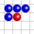
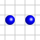

# Jeu de la vie Version JAVASCRIPT
_(inspiration de la vidéo youtube de science étonnante)_

Après visionnage de la vidéo sur l'origine et l'explication du fonctionnement du "Jeu de la vie" par *science étonnante*,
J'ai lancé le défie à un collègue de promo & moi même de recrée cette expérience sur une page HTML CSS et de géré l'activité en **JAVASCRIPT**.

## Le principe

Le Jeu de la vie est un « jeu à zéro joueur », puisqu'il ne nécessite aucune intervention du joueur lors de son déroulement. 
Il s’agit d’un automate cellulaire, un modèle où chaque état conduit mécaniquement à l’état suivant à partir de règles pré-établies.

### Explication & règles

Le jeu se déroule sur une grille à deux dimensions, théoriquement infinie (*mais ici limité pour le moment*), dont les cases — appelées « cellules »,
 par analogie avec les cellules vivantes — peuvent prendre deux états distincts : **vivante** ou  **morte**.

 - Une cellules ***vivante*** sera **noir**.
 - Une cellules *morte* sera **blanche**.

Une cellule possède huit voisins, qui sont les cellules adjacentes horizontalement, verticalement et diagonalement.

- Un tour de boucle ou cycle sera à chaque seconde.

À chaque tour de boucle (*cycle*), l'état d’une cellule est entièrement déterminé par l’état de ses huit cellules voisines, selon les règles suivantes :

- Une chute de « bombes » non périodique.
- Une cellule **morte** possédant exactement trois cellules voisines vivantes devient vivante (elle naît) ;
- Une cellule **vivante** possédant deux ou trois cellules voisines vivantes le reste, sinon elle meurt.

Ainsi, la configuration  donne au tour suivant la configuration  qui redonne ensuite la première.

On peut également formuler cette évolution ainsi :

 - si une cellule a exactement trois voisines vivantes, elle est vivante à l’étape suivante.
C’est le cas de la cellule verte dans la configuration de gauche ;

 - si une cellule a exactement deux voisines vivantes, elle reste dans son état actuel à l’étape suivante.
Dans le cas de la configuration de gauche, la cellule située entre les deux cellules vivantes reste morte à l’étape suivante ;

 - si une cellule a strictement moins de deux ou strictement plus de trois voisines vivantes, elle est morte à l’étape suivante.
C’est le cas de la cellule rouge dans la configuration de gauche.

### Pré-requis de Page

Ce qui est requis pour commencer le projet...

- Un encart qui affiche le temps écouler en haut au centre de l'écran 
- Une grille comportant nos cellules (mort ou vivante)
- 4 Bouton ('play' - 'pause' - 'avance rapide' - 'replay')
- Un Gros bouton 'Reset' afin de repartir à zéro.

### Intéraction

L'utilisateur devra pouvoir lui même **avant** de commmencer une boucle (*cycle*) choisir qui parmit les cellules seras vivante ou non. 

Il devra également être dans la posibiliter de mettre sur pause ou d'accélérer le processus.

## Démarrage

Dites comment faire pour lancer votre projet

## Fabriqué avec :

VisualStudioCode

Inspiré de => https://www.youtube.com/watch?v=S-W0NX97DB0

## Participant au projet 

- Gille P. : Helper
- Acdhir : Helper

## Auteurs

- Julien Fernandez : Développeur
- Antoine Terrade : Développeur